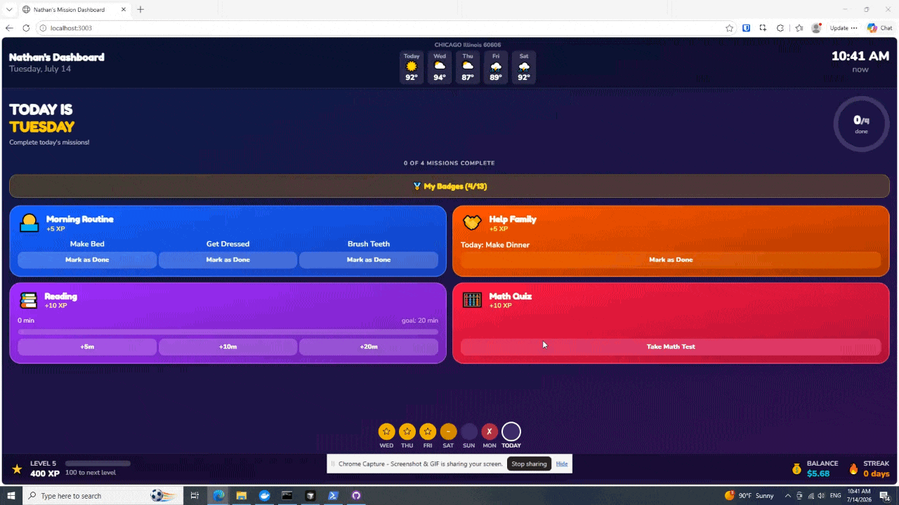
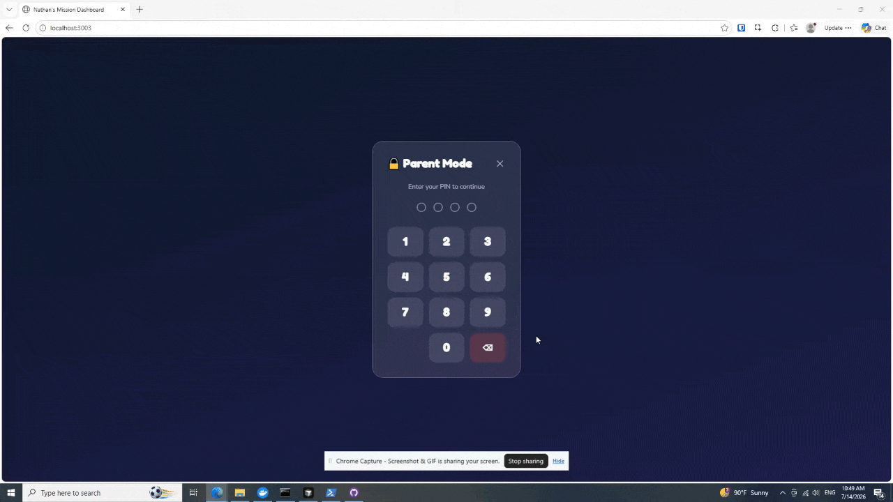
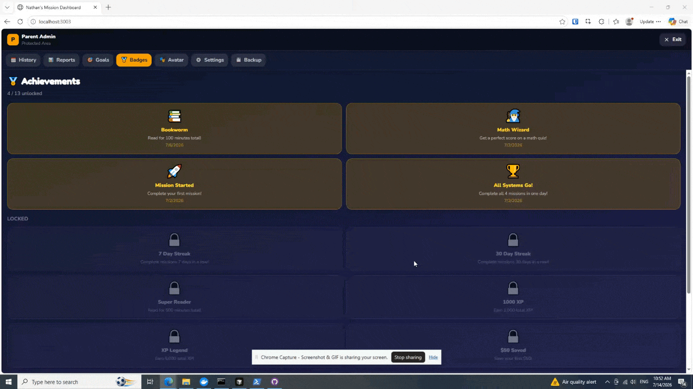

<div align="center">

# 🚀 Kids Mission Dashboard

**Complete today's missions!**

A kid-friendly daily mission board for families — morning routine, helper chores, reading, and math.

⭐ XP · 🔥 Streaks · 💰 Allowance · 🌤️ Weather · 🎨 Themes

<br />

<!-- Drop your demo GIF at docs/video.gif — it will show here automatically -->


<br />

<br />


</div>

---

> ⚠️ **Home network only** — built for a family tablet mounted your wall on your Wi‑Fi. Not intended for the public internet.

---

## 🎯 Today's Missions

| | Mission | What kids do | XP |
|---|---------|--------------|-----|
| 🌅 | **Morning Routine** | Make bed · get dressed · brush teeth | +5 |
| 🤝 | **Help the Family** | One chore per weekday (parent-configured) | +5 |
| 📚 | **Reading** | Hit the daily minute goal | +10 |
| 🧮 | **Math Quiz** | Grade K–5 questions · pass to complete | +10–20 |

Finish all four → allowance progress for the day 🏆

---

## ✨ Features

<table>
<tr>
<td width="50%">

**👶 Child dashboard**
- 4 mission tiles + progress ring
- 7-day streak strip
- XP, level, and allowance bar
- 5-day weather forecast
- Night dim (auto schedule)

</td>
<td width="50%">

**🔒 Parent admin**
- Tap the title **5 times** → PIN
- History, reports, goals, badges
- Full settings & backup
- Default PIN: `1234` *(change this!)*

</td>
</tr>
</table>

### ⚙️ Configurable in Settings

- Child's name · birthday · timezone · weather ZIP
- **6 themes:** 🚀 Default · 🦄 Unicorn · 🌲 Forest · 🌊 Ocean · 🦕 Dino · 🧚 Fairy Garden
- Weekly helper-task schedule (Mon–Sun)
- Math level: Kindergarten through 5th grade
- Night dim: Off / On / Auto (default 9:00 PM – 6:00 AM)

---

## 🎬 Demo GIF

<div align="center"><b>
   Reports and Badges

</br></br>
   Settings

</b></div>
---

## ⚡ Quick start

<details open>
<summary><strong>🐳 Docker (recommended)</strong></summary>

Requires [Docker Desktop](https://www.docker.com/products/docker-desktop/) (or Docker Engine + Compose).

```bash
git clone https://github.com/YOUR_USERNAME/kids-mission-dashboard.git
cd kids-mission-dashboard
docker compose up -d --build
```

Open **http://localhost:4000** on your tablet or PC.

Data lives in a Docker volume (`dashboard-data`). To reset everything:

```bash
docker compose down -v
```

</details>

<details>
<summary><strong>📦 Node.js (no Docker)</strong></summary>

Requires **Node.js 20+**.

```bash
git clone https://github.com/YOUR_USERNAME/kids-mission-dashboard.git
cd kids-mission-dashboard
npm install
npm run build
npm start
```

Open **http://localhost:4000**.

Progress is saved in `data/dashboard.json` on the server (gitignored — each family keeps their own).

</details>

<details>
<summary><strong>🛠️ Development</strong></summary>

Runs the API on port **4000** and Vite on **3003**:

```bash
npm install
npm run dev
```

Open **http://localhost:3003**.

</details>

---

## 🏁 First-time setup

1. Open the dashboard on your tablet — bookmark it or **Add to Home Screen** for fullscreen.
2. Tap the **title 5 times** → enter parent PIN (**default: `1234`**).
3. Go to **Settings** and update:
   - Child's name
   - Parent PIN
   - Timezone & weather ZIP
   - Weekly helper tasks
   - Theme
4. Tap **SAVE SETTINGS**.

---

## 📱 Tablet tips

- Wall-mount your tablet, leaving it plugged in. You can disable sleep while plugged in.
- Open self-hosted website in browser, put in full screen. Feel free to zoom in/out based on your device resolution.
- Leave the tab open overnight if you use **auto night dim** or midnight mission rollover.
- Use **Admin → Backup** to export JSON before updates or big setting changes.

---

## 🔐 Security notes

| | |
|---|---|
| 🔓 | The parent PIN only locks the **UI** — the API has no server-side auth. |
| 🏠 | Run on a **trusted home network** only. |
| 🚫 | Do **not** port-forward to the internet without proper auth and HTTPS. |
| 📄 | `data/dashboard.json` holds name, birthday, PIN, and history — **never commit it**. |

---

## 📂 Project structure

| Path | Purpose |
|------|---------|
| `src/` | React frontend |
| `server/index.js` | Express API + static files (production) |
| `data/dashboard.json` | Live family data (local only, gitignored) |
| `docs/video.gif` | README demo animation *(add yours)* |
| `docker-compose.yml` | One-command install |

---

## 📜 License

MIT — see [LICENSE](LICENSE).

---

<div align="center">

**Made for families who want missions, not nagging.** 🎉

</div>
